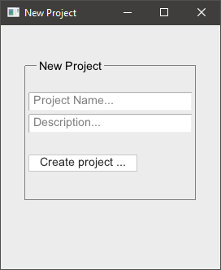
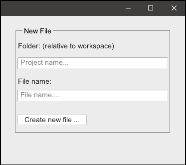

# VIDE: Simple IDE for V  

 
    </h1>

 

A simple IDE for [V](https://vlang.io/).

The main UI is currently written in Swing as VUI is not fully complete, and I am more familiar with Java.
Dialogs are written in V.

Screenshots:

  
&nbsp;

