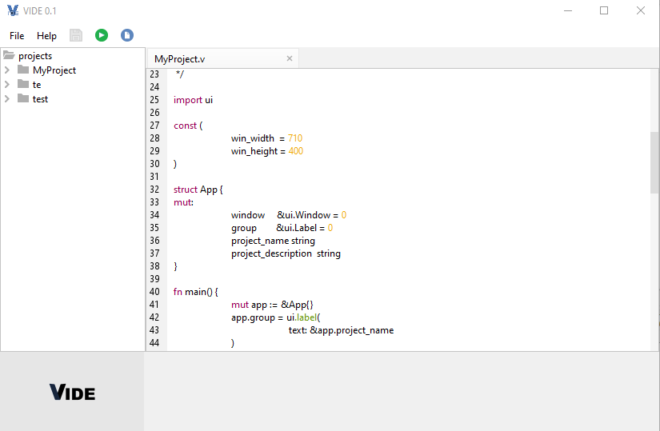

    

<h1>A simple IDE made for Vlang</h1>

A simple IDE for [V](https://vlang.io/).

The main UI is currently written in Swing as VUI is not fully complete, and I am more familiar with Java.
Dialogs are written in V.

