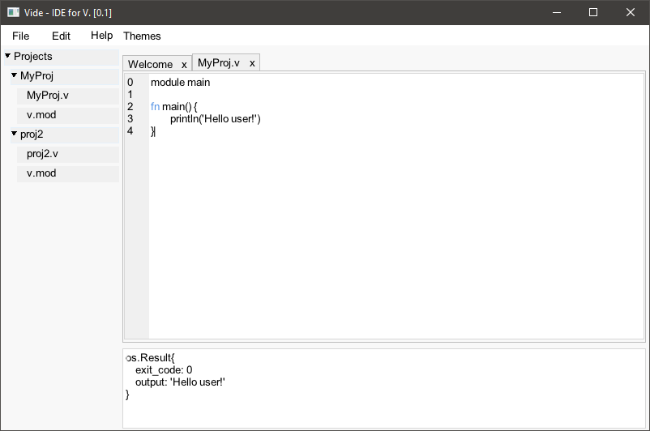
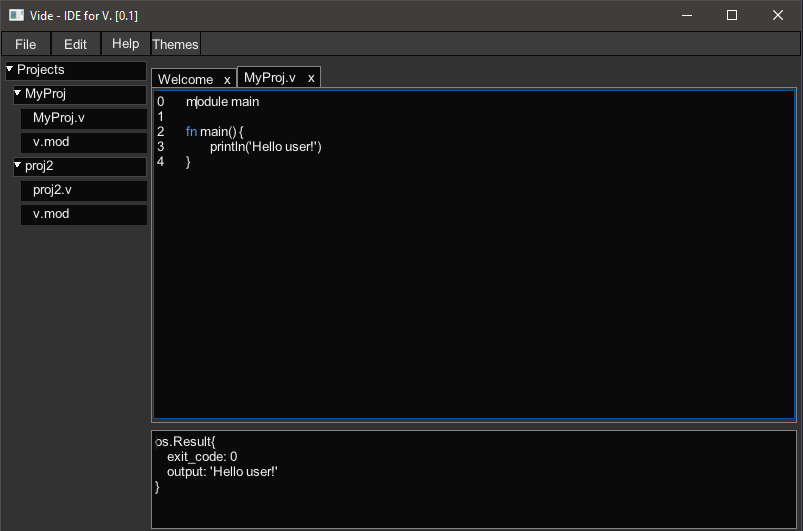

# VIDE: Simple IDE for V  

 
    </h1>

 

A simple IDE for [V](https://vlang.io/) made in V.

**Note:** Pre-alpha software, will include bugs. 

## Screenshots:

   

## Known Issues
- Memory Leak (Fine with `-gc boehm`)
- Bad Textbox.

## Resource Requirements

| IDE     | Disk    | RAM     |
|---------|---------|---------|
|         |         |         |
| Vide    | < 2MB   | ~ 50MB  |
| VS Code | 308MB   | ~ 330MB |
|         |         |         |
